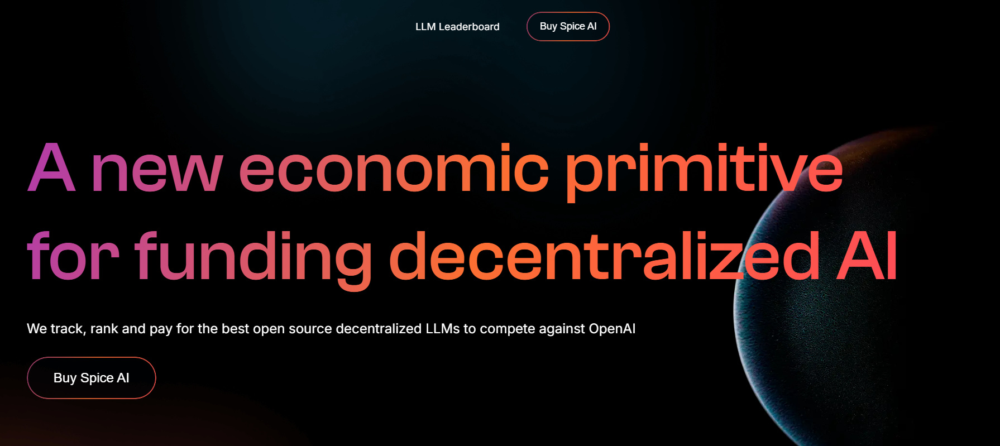

# Parallax Website

A modern, responsive landing page built with **Next.js**, enhanced with smooth **GSAP** parallax scroll animations.



## Tech Stack

- **Framework:** [Next.js](https://nextjs.org/)
- **Animations:** [GSAP](https://greensock.com/gsap/), [ScrollTrigger](https://greensock.com/scrolltrigger/)
- **Styling:** CSS Modules
- **Assets:** `next/image` for performance
- **Deployment:** Vercel

## Getting Started

### Clone the repo

```bash
git clone https://github.com/AslanovRustam/ai-parallax.git
cd ai-parallax
```

Run the dev server

```bash
npm run dev
```

Visit http://localhost:3000

#### Customization

Parallax animation is controlled via GSAP inside Hero.tsx using ScrollTrigger.

You can adjust scroll ranges, pinning, and animations in the useGSAP() call.
